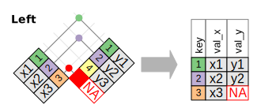
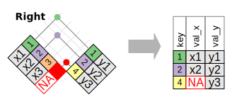
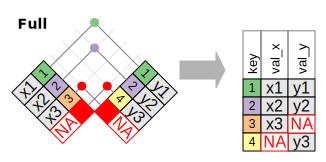
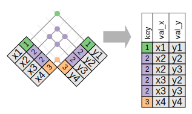
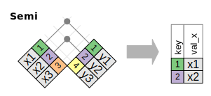
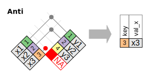

<style type="text/css">
pre {
  font-family: 'Source Code Pro', 'Courier New', monospace;
  font-size: 16px;
  line-height: 17px;
  padding: 25px 0 5px 5px;
  letter-spacing: -1px;
  margin-bottom: 5px;
  width: 106%;
  left: -60px;
  position: relative;
  -webkit-box-sizing: border-box;
  -moz-box-sizing: border-box;
  box-sizing: border-box;
  /*overflow: hidden;*/
}

fullwidth { 
  width: 100%; 
  height: auto;
  margin-left: auto;
  margin-right: auto;
  display: block;
}

partialheight { 
  width: auto;
  height: 20%; 
  margin-left: auto;
  margin-right: auto;
  display: block;
}
</style>


## Hadleyverse
```{r loadanddownload, echo=FALSE, message = FALSE, error=FALSE, warning=FALSE, cache= TRUE}
#code shamelessly borrowed from : http://adolfoalvarez.cl/the-hitchhikers-guide-to-the-hadleyverse/

#Import as data frame the RDS file with packages information. It can be obtained from CRAN,
download.file("http://cran.r-project.org/web/packages/packages.rds", "packages.rds")
rds <- readRDS(file="packages.rds")
data <- as.data.frame(rds, stringsAsFactors = FALSE)
```

```{r igraphplot, echo=FALSE, message = FALSE, error=FALSE, warning=FALSE, cache= FALSE, out.width=740, out.height=400}
library(lazyeval)
library(dplyr)
library(igraph)

data <- data[,!duplicated(names(data))] #Eliminate duplicated names column
names(data) <- gsub(" ","_", names(data))
names(data) <- gsub("/","_", names(data))
names(data) <- gsub("@","_", names(data))

data <- tbl_df(data)

hadley <- data %>%
  filter(grepl("Hadley Wickham|Hadley\nWickham", Author)) %>%
  select(Package, Author, Depends, Imports, Suggests, LinkingTo, Enhances)

#Vector of packages
packages <- unique(hadley$Package)

relations <- function(var){
  temp <- strsplit(var, ",") #Split string of dependences
  package2 <- unlist(temp) #
  #Eliminate some characters...
  package2 <- gsub(" ","", package2) 
  package2 <- gsub("\\(.*\\)","",package2)
  package2 <- gsub("\n","",package2)
  package1 <- rep(hadley$Package,unlist(lapply(temp,length))) #Obtain the corresponding id
  df <- data.frame(package1,package2, stringsAsFactors = FALSE)
  #We want only related packages created by H.W.
  df <- df %>%
    filter(package2%in%packages,
           package2!=package1
           )
  return(df)
}

#Apply the function to each variable and collapse the resulting list to a single data frame
hadley2 <- lapply(hadley, relations)
hadley2 <- do.call("rbind", hadley2)

#Eliminate possible duplicates
edges <- tbl_df(distinct(hadley2))  

g <- graph.data.frame(edges, vertices= packages,  directed = F) # We create the igraph object based on the "edges" data frame

# Edges Properties

E(g)$arrow.width <- 0 # I don't want end of arrows to be displayed but that can change in the future
E(g)$curved <- 0.2 #Make edges curved
E(g)$color  <- "#F2F2F2"
E(g)$width  <- 1.5

# Vertex Properties
V(g)$label.family <- "sans" #Label font family
V(g)$label.cex <- 0.8 # Label font size proportional to 12
V(g)$label.color <- "#333333" # Label font color
V(g)$label.font <- 1 #1 plain, 2 bold, 3 italic, 4 bold and italic
V(g)$size <- degree(g, mode = "in", loops = F) #Size proportional to degree

#cl <- optimal.community(g) #Find communities in the network, takes 15 minutes


#Color of vertices based on communities
#V(g)$color <- unlist(c("#E2D200", "#BFBFBF", "#46ACC8", "#E58601", rep("#BFBFBF",6))[cl$membership])
#V(g)$frame.color <- unlist(c("#E2D200", "#BFBFBF", "#46ACC8", "#E58601", rep("#BFBFBF",6))[cl$membership])

#layout <- layout.kamada.kawai(g)
layout <- layout.random(g)

par(mar=c(0,0,0,0)+.1)
plot(g, margin=-0.1, layout=layout, asp=0)
```
<font size="2">code shamelessly borrowed from : http://adolfoalvarez.cl/the-hitchhikers-guide-to-the-hadleyverse/</font>

## Hadleyverse

  - Ingest (rvest, readr, readxl)
  - Manipulate (**dplyr**)
  - Visualize (ggplot2, ggvis)
  - Create packages (devtools, testthat)
  - Simplify programming (purrr, lazyeval)
  - and data packages (ggplot2movies, nycflights13)

## dplyr

dplyr provides a set of tools to assemble, transform, and summarize your data. 


## Single table verbs

`dplyr` implements the following verbs useful for data manipulation:

* `select()`: focus on a subset of variables
* `filter()`: focus on a subset of rows
* `mutate()`: add new columns
* `summarise()`: reduce each group to a smaller number of summary statistics
* `arrange()`: re-order the rows

## More information about single table verbs
Michael Levy's Intro to dplyr presentation to D-RUG Oct. 2014
http://michaellevy.name/blog/dplyr-data-manipulation-in-r-made-easy/


## Multiple table verbs (Joins)

In addition to single table verbs, there are also a set of verbs that operate on two tables at a time: joins and set operations.

* Joins
    + `inner_join(x, y)`: matching x + y
    + `left_join(x, y)`: all x + matching y
    + `semi_join(x, y)`: all x with match in y
    + `anti_join(x, y)`: all x without match in y
* Sets
    + `intersect(x, y)`: all rows in both x and y
    + `union(x, y)`: rows in either x or y
    + `setdiff(x, y)`: rows in x, but not y

## Why Joins?

Real data is messy.
<center></center>
<!-- The important thing to point out here is that it is rare that everything is stored in a single place and that sometimes it's not even got a single key that unifies everything so you have to join then join then join. --> 

## Example Data Joins

```{r c3po, smaller)}
require(dplyr)
set.seed(12345) #that's amazing, I've got the same combination on my luggage!
x <- data.frame(key= LETTERS[c(1:3, 5)], value1 = sample(1:10, 4), stringsAsFactors = FALSE)
y <- data.frame(key= LETTERS[c(1:4)], value2 = sample(1:10, 4), stringsAsFactors = FALSE)

x
y
```

## inner_join

Rows with matching keys from x and y.
<center>

</center>
```{r inner}
inner_join(x, y, by = "key")
```

## left_join
All rows from x and those that match the key in y.
<center>

</center>
```{r left}
left_join(x, y, by = "key")
```

## right_join
All rows from y and those that match the key in x.
<center>

</center>
```{r right}
right_join(x, y, by = "key")
```

## full_join
All rows from x and y.
<center>

</center>
```{r full}
full_join(x, y, by = "key")
```

## Duplicate keys
<font size="3">When you match keys on non-unique rows you get all possible combinations out. Be careful. </font>
<center>


</center>

## Filtering Joins
Semi and Anti joins don't actually join two datasets together. They filter one dataset based upon what's in another. This is useful when:

  - you want to filter your dataset based upon another (semi)
  - or want to understand what isn't in both datasets (anti)

## semi_join
All rows from x that have a key match in y.
<center>

</center>
```{r semi}
semi_join(x, y, by = "key")
```

## anti_join
All rows from x that have no key match in y.
<center>

</center>
```{r anti}
anti_join(x, y, by = "key")
```

## Want everything that doesn't match?
Combine join statements.

```{r combinejoins}
full_join(anti_join(x,y, by = "key"), anti_join(y,x, by = "key"), by= "key")
```

## Different keys?

Real data is messy. If key1 is "date" and key2 is "Date" things break. So, specify:
``` {r ATAT, error=TRUE} 
set.seed(12345) #that's amazing, I've got the same combination on my luggage!
x <- data.frame(keyX= LETTERS[c(1:3, 5)], value1 = sample(1:10, 4), stringsAsFactors = FALSE)
y <- data.frame(keyY= LETTERS[c(1:4)], value2 = sample(1:10, 4), stringsAsFactors = FALSE)

full_join(x, y)
full_join(x, y, by=c("keyX" = "keyY"))
```


## Set operations
You have two datasets that should be the same, but you're not sure if they are. How do you easily test that they are the same? 

* Sets
    + `intersect(x, y)`: all rows in both x and y
    + `union(x, y)`: rows in either x or y
    + `setdiff(x, y)`: rows in x, but not y

## Set Operations
Set operations are on the entire row, there is no "key".
<center>

</center>

## Example Data Set Ops

```{r bwing)}
df1 <- data_frame(x = LETTERS[1:2], y = c(1L, 1L))
df2 <- data_frame(x = LETTERS[1:2], y = 1:2)

df1

df2
```

## intersect
Which rows are common in both datasets?
```{r xwing)}
dplyr::intersect(df1, df2)
```


## union
Want all unique rows between both datasets?
```{r ywing)}
dplyr::union(df1, df2)
```

## setdiff
What's unique to df1?
```{r awing)}
dplyr::setdiff(df1, df2)
```
What's unique to df2?
```{r tiefighter)}
dplyr::setdiff(df2, df1)
```

## Questions
<center>
<font size="20">?</font>
</center>


More information:
  - http://r4ds.had.co.nz/relational-data.html

<font size="2">All diagrams courtesy of Hadley Wickham</font>
